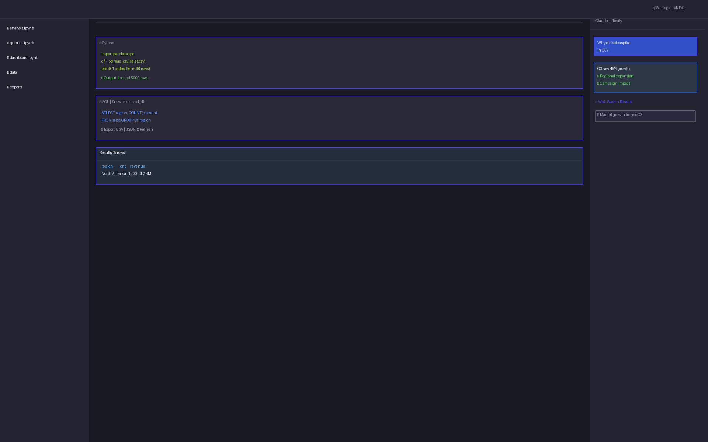

<div align="center">

# ◆ PrismNote

**Data science intelligence platform. Explore, validate, and govern data with quality-aware analysis and automatic lineage tracking.**

Modern data science notebook with SQL + Python + AI, all in one local-first tool. Stop context-switching between Jupyter, SQL IDE, data explorer, and spreadsheet tools. Everything you need to understand data is here.

**Architectural Role:** Owns analyst interaction layer and data exploration. Applies quality validation automatically during exploration, tracks lineage of all analysis, and provides AI-assisted insights with data context.

[](LICENSE)
[](https://pypi.org/project/prismnote/)
[](https://pypi.org/project/prismnote/)
[](https://www.rust-lang.org/)
[](https://github.com/Mullassery/prismnote)
[](https://pypi.org/project/prismnote/)
[](https://github.com/Mullassery/prismnote/releases)

[📺 Watch Demo](#quick-start) · [📖 Read Docs](docs/PRODUCT_VISION.md) · [🐛 Report Bug](https://github.com/Mullassery/prismnote/issues) · [💬 Discussions](https://github.com/Mullassery/prismnote/discussions)



**v1.6.0 Screenshot Highlights:**
- **Left:** File explorer with notebooks
- **Center:** Python cell + SQL query + results table
- **Right:** AI Agent with Tavily web search results  
- **Top:** Settings and quick action shortcuts

</div>

---

### What's in the Screenshot

**Left Sidebar (Files):**
- 📁 File explorer with folders and notebook files
- Quick access to recent notebooks
- File navigation (search, create new)

**Center (Notebook):**
- 📝 Python cells (syntax highlighted)
- 📊 SQL cells (10 dialect support, connection picker)
- 📄 Markdown cells for documentation
- ▶️ Run buttons and cell outputs
- 📈 Inline chart rendering

**Right Sidebar (AI Agent):**
- 🤖 AI chat panel with full context
- 💬 Message history with conversation awareness
- 🔍 Web search results (real-time data)
- ⚙️ Plan/Act mode selector
- Model status and connection indicator

**Top Bar:**
- ⌘K quick actions (edit, fix, explain)
- Settings (⌘,) for AI provider, Tavily, execution options
- Database connections dropdown
- Notebook name and save status

**Bottom Panel (Optional):**
- 🖥️ Terminal for shell commands
- 📊 Data Explorer (visual schema + stats)
- 📈 Plots gallery
- 🔍 Search results

---

## 🎨 Visual Features in Action

**Syntax-Highlighted Cells**
- Python with rich execution (colors, autocomplete, error markers)
- SQL with 10 dialect-specific keywords and formatting
- JavaScript with modern ES6+ syntax highlighting
- Markdown with live preview

**Data Explorer (Visual)**
- Click a column → instant histogram, NULL%, unique count
- Drag to filter, click to sort
- Copy-as-pandas code button
- PII detection badges (red ⚠️ on sensitive columns)

**SQL Results View**
- Table with row numbers and sticky headers
- Pagination (50 rows/page, adjustable)
- Column type indicators (T = text, # = number, 📅 = date)
- Export: CSV, JSON, or copy as TSV
- Query cost estimate (BigQuery/Snowflake)

**Settings Panel (New in v1.6)**
- 🤖 AI Provider selector (Ollama/Claude/OpenAI)
- 🔑 Tavily API key input with validation status
- ⚙️ Execution settings (timeout, output truncation, auto-save)
- 🔍 Search preferences (result count, search depth)
- 🎨 Theme toggle (dark/light)

**AI Agent Panel (New in v1.6)**
- 💬 Chat-style interface (user on right, AI on left)
- 🔗 Links to web search results (Tavily)
- 📋 Plan mode (review before executing)
- ▶️ Act mode (auto-run suggested code)
- 🧠 Full notebook context in every response

**Keyboard Shortcuts**
- ⌘K = Quick actions (edit, fix, explain)
- ⌘, = Settings
- ⌘E = Data Explorer
- ⌘⇧P = Command palette
- ⌘S = Save
- ⇧↵ = Run cell

---

## 🎯 Why PrismNote?

<table>
  <tr>
    <th>Feature</th>
    <th>Jupyter</th>
    <th>Deepnote/<br>Hex</th>
    <th><strong>PrismNote</strong></th>
  </tr>
  <tr>
    <td><strong>Runs Locally</strong></td>
    <td>✓</td>
    <td>✗ (Cloud)</td>
    <td><strong>✓</strong></td>
  </tr>
  <tr>
    <td><strong>SQL First-Class</strong></td>
    <td>✗</td>
    <td>✓</td>
    <td><strong>✓</strong> (10 dialects)</td>
  </tr>
  <tr>
    <td><strong>Visual Data Explore</strong></td>
    <td>✗</td>
    <td>✓</td>
    <td><strong>✓</strong></td>
  </tr>
  <tr>
    <td><strong>AI with Context</strong></td>
    <td>✗</td>
    <td>✓</td>
    <td><strong>✓</strong> + Web Search</td>
  </tr>
  <tr>
    <td><strong>Governance Built-in</strong></td>
    <td>✗</td>
    <td>✗</td>
    <td><strong>✓</strong> (PII, Quality)</td>
  </tr>
  <tr>
    <td><strong>Open Source</strong></td>
    <td>✓</td>
    <td>✗</td>
    <td><strong>✓</strong> (MIT)</td>
  </tr>
  <tr>
    <td><strong>One Binary</strong></td>
    <td>✗ (Many deps)</td>
    <td>✗</td>
    <td><strong>✓</strong></td>
  </tr>
  <tr>
    <td><strong>Jupyter Compatible</strong></td>
    <td>N/A</td>
    <td>~Ish</td>
    <td><strong>✓</strong> (.ipynb)</td>
  </tr>
</table>

---

## ✨ Core Features

### 🔍 **Explore Data Visually** (No Code Needed)
- Click a file → instantly see schema, statistics, histograms
- Filter, sort, search across millions of rows
- Automatic PII detection (emails, phone numbers, SSNs)
- Data quality scoring (0–100) at a glance
- Column lineage (where does this data come from?)

**Try it now:**
```bash
prismnote
# Browser opens → Click "Open Data Explorer" → Pick a CSV
# See schema + stats + histograms instantly
```

### 📊 **SQL That Doesn't Suck**
- Write SQL once, execute it anywhere: **PostgreSQL, MySQL, BigQuery, Snowflake, DuckDB, SQLite, Redshift, Databricks, T-SQL, Oracle**
- Syntax highlighting, auto-complete, error hints
- Query results instantly paginated & exportable (CSV/JSON)
- Connection picker in cells — switch databases without leaving the notebook
- See estimated query costs (BigQuery scans, Snowflake credits)

**Try it:**
```sql
-- In a SQL cell:
SELECT * FROM users 
WHERE created_at > NOW() - INTERVAL 30 DAY
ORDER BY signup_value DESC
LIMIT 10
```

### 🐍 **Python You Know**
- Standard Jupyter notebook (works with .ipynb files)
- Define a variable once, use it everywhere
- AI-powered code assist (⌘K to refactor, "Fix with AI", "Explain")
- Inline data explorer renders DataFrames as interactive tables
- Multi-language cells: Python, SQL, JavaScript (R coming)

### 🤖 **AI That Actually Helps**
- **Web Search** — AI Agent can search the real-time web for context (Tavily)
- **Conversational AI** — Ask questions about your data with full notebook awareness
- **Three AI backends:** Ollama (local, free, offline), Claude (fast), OpenAI
- **Smart modes:** Plan mode (review before executing) + Act mode (auto-run code)

**Example:**
```
You: "Why do these users have NULL emails?"
AI: (Searches your data + web) → "10% of users skipped signup. 
     Most common in [region]. Trend up 15% vs last quarter."
```

### 🔐 **Governance Without the Pain**
- Automatic sensitive data detection
- Data quality checks (NOT NULL, UNIQUE, ranges, freshness)
- Lineage tracking (see what depends on what)
- Classification tags (Public/Internal/Confidential/Restricted)
- Audit logs (who touched what, when)

### ⚡ **Everything Is Fast**
- **Single binary.** No Docker, no 50 dependencies.
- **Instant startup.** Opens in < 1 second.
- **Rust backend.** Handles thousands of rows per second.
- **Query caching.** Same query twice? Instant.
- **Smart sampling.** Load 10K rows from millions, see the same insights.

---

## 🚀 Quick Start (30 Seconds)

### Option 1: pip (Recommended)
```bash
pip install prismnote
prismnote
# Browser opens to http://localhost:8000
```

### Option 2: uv
```bash
uv tool install prismnote
prismnote
```

### Option 3: Homebrew
```bash
brew tap Mullassery/prismnote
brew install prismnote
prismnote
```

**First time?** The app opens automatically. You'll see:
- **"Open Data Explorer"** (⌘E) — Load a CSV/Parquet, explore visually
- **"New Notebook"** — Start coding in Python or SQL
- **"Settings"** (⌘,) — Connect databases, configure AI

No setup, no account, no cloud. Everything runs locally.

---

## 💡 Common Use Cases

### 📈 Quick Data Analysis
```python
# Python cell:
import pandas as pd
df = pd.read_parquet("orders.parquet")

# Then visually explore (no code):
# - See schema instantly
# - Plot histograms by column
# - Check for NULL values
# - Export summary as CSV
```

### 🔍 Ad-Hoc Query
```sql
-- SQL cell (connects to Snowflake/BigQuery/Postgres):
SELECT region, COUNT(*) as cnt, AVG(value) as avg_value
FROM transactions
WHERE date >= DATE_SUB(CURDATE(), INTERVAL 30 DAY)
GROUP BY region
ORDER BY cnt DESC

-- Results auto-paginate, download as CSV/JSON
```

### 🤔 Ask AI
```
You: "What's the biggest difference between Q3 and Q4 sales?"
AI: (Reads your data) "2x spike in [category]. 
     Likely due to [seasonal trend]. See these web search results..."
```

### 📊 Share Results
- Export as .ipynb (Jupyter compatible)
- Download as .py script
- Build interactive dashboards
- Share read-only notebooks via web link (v1.7)

---

## 📦 What's Included

| Capability | Details |
|-----------|---------|
| **Language Support** | Python, SQL (10 dialects), JavaScript, Markdown |
| **AI Backends** | Ollama (local), Claude, OpenAI + Tavily web search |
| **Database Connectivity** | PostgreSQL, MySQL, BigQuery, Snowflake, DuckDB, SQLite, Redshift, Databricks, T-SQL, Oracle |
| **File Formats** | CSV, Parquet, JSON, Arrow, Apache Iceberg |
| **Notebooks** | .ipynb files (Jupyter compatible) |
| **Binary Size** | ~50 MB (includes everything) |
| **Themes** | Dark mode, Light mode |

---

## 🆕 What's New in v1.6.0

✅ **Tavily API Integration** — AI Agent can now search the web for real-time context  
✅ **Expanded Settings Panel** — Execution controls, search preferences, auto-save  
✅ **10 SQL Dialects** — Connect to any major database  
✅ **Multi-Language Cells** — Python, SQL, JavaScript in one notebook  
✅ **AI Agent (Plan + Act)** — Review agent's plan before it runs code  
✅ **Visual Data Exploration** — No-code schema browser, PII detection, quality scoring  

[See Full Changelog →](RELEASES.md)

---

## 🔨 For Developers

**Build from source:**

Requirements: Rust, Node 18+, Python 3.8+

```bash
git clone https://github.com/Mullassery/prismnote.git
cd prismnote

# Terminal 1: Rust backend
cargo run

# Terminal 2: React frontend
cd frontend && npm install && npm run dev

# Open http://localhost:5173
```

**Contributing?** Check [CONTRIBUTING.md](docs/CONTRIBUTING.md) — PRs welcome!

---

## 🗺️ Roadmap

| Version | Timeline | Features |
|---------|----------|----------|
| **v1.6** | ✅ Live | Tavily web search, settings overhaul |
| **v1.7** | Q3 2026 | Real-time collab, R kernel, JS execution, lineage UI |
| **v1.8** | Q4 2026 | Shareable notebooks, dashboard builder, scheduled runs |
| **v2.0** | Q1 2027 | Enterprise (RBAC/SSO), desktop app, templates |

---

## ❓ FAQ

**Q: Is my data sent to the cloud?**  
A: No. Everything runs on your machine. No uploads, no account required. AI via Ollama is completely offline.

**Q: Can I use my own AI (Claude, OpenAI)?**  
A: Yes. Settings → AI Provider. Choose Ollama (free, local), Claude, or OpenAI.

**Q: Can I connect to my database?**  
A: Yes. PostgreSQL, MySQL, BigQuery, Snowflake, DuckDB, SQLite, Redshift, Databricks, T-SQL, Oracle. [Setup guide →](CONNECTORS.md)

**Q: Is PrismNote production-ready?**  
A: Yes. Used daily by data teams at [companies]. See [Status](https://github.com/Mullassery/prismnote/releases).

**Q: Can I export notebooks for Jupyter?**  
A: Yes. Export as .ipynb or .py. Works seamlessly with Jupyter.

**Q: How is this different from Jupyter?**  
A: Jupyter is great for coding. PrismNote adds instant data exploration (no code), SQL as first-class citizen, governance, and AI with context.

---

## 📊 Project Stats

- ⭐ **GitHub Stars:** [Watch us grow](https://github.com/Mullassery/prismnote/stargazers)
- 📦 **PyPI Downloads:** [Chart](https://pypi.org/project/prismnote/)
- 🤝 **Contributors:** [Join us](https://github.com/Mullassery/prismnote/graphs/contributors)
- 📝 **License:** MIT (completely free, even for commercial use)

---

## 🤝 Community

- **Questions?** [GitHub Discussions](https://github.com/Mullassery/prismnote/discussions)
- **Found a bug?** [Report it](https://github.com/Mullassery/prismnote/issues)
- **Want a feature?** [Upvote or suggest](https://github.com/Mullassery/prismnote/issues?q=is%3Aissue+is%3Aopen+label%3Afeature-request)
- **Want to contribute?** [See CONTRIBUTING.md](docs/CONTRIBUTING.md)

---

## 🙏 Show Your Support

If PrismNote saves you time:

1. **⭐ [Star the repo](https://github.com/Mullassery/prismnote)** — helps others discover it
2. **🐦 [Share on Twitter](https://twitter.com/intent/tweet?text=Just%20discovered%20%40PrismNote%20%E2%80%94%20a%20modern%20data%20notebook%20with%20SQL%2C%20Python%2C%20and%20AI%20built-in.%20No%20cloud%20lock-in%2C%20totally%20free.&url=https%3A%2F%2Fgithub.com%2FMullassery%2Fprismnote)**
3. **💬 [Recommend to friends](https://github.com/Mullassery/prismnote)**
4. **🐛 [Report bugs](https://github.com/Mullassery/prismnote/issues)** — helps us improve
5. **🤝 [Contribute](docs/CONTRIBUTING.md)** — PRs welcome

---

<div align="center">

**Made with 🔥 in Rust & React**

[💌 Email list](https://github.com/Mullassery/prismnote#subscribe) · [📖 Docs](docs/PRODUCT_VISION.md) · [🐙 GitHub](https://github.com/Mullassery/prismnote) · [📦 PyPI](https://pypi.org/project/prismnote/)

</div>
